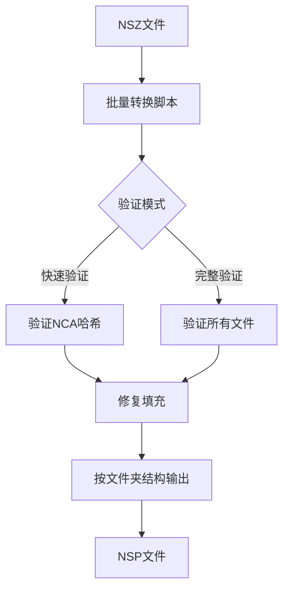

# 🎮 NSZ to NSP 批量转换工具

<div align="center">

**高效、可靠的Nintendo Switch NSZ文件批量转换工具**

[](https://github.com/micherwa/nsz-to-nsp/actions/workflows/test.yml)
[](https://www.python.org/)
[](https://github.com)
[](LICENSE)

[功能特性](#-功能特性) • [快速开始](#-快速开始) • [详细使用](#-详细使用) • [故障排除](#-故障排除)

</div>

---

## 📋 项目简介

基于 [nicoboss/nsz](https://github.com/nicoboss/nsz) 开发的增强版本，专为批量转换Nintendo Switch的NSZ压缩文件而设计。提供了完整的批量处理工具链，支持文件验证、目录结构保持等高级功能。

使用本工具前，请确保已经下载了龙神模拟器Ryujinx，并在mac的用户目录下创建了.switch文件夹，相关的key文件已存在。


模拟器及key文件的安装，可参考：[龙神模拟器（Switch模拟器）手把手教程](https://www.bilibili.com/video/BV1dw41137zs/?spm_id_from=333.337.search-card.all.click&vd_source=f1e502a681892ecca73613c0df4cb6c2)

## ✨ 功能特性

| 功能 | 描述 | 状态 |
|------|------|------|
| 🔄 **批量转换** | 一次性转换多个NSZ文件 | ✅ |
| 📁 **目录保持** | 按原始文件夹结构组织输出文件 | ✅ |
| 🔍 **文件验证** | 快速验证和完整验证模式 | ✅ |
| 🔧 **兼容性优化** | PFS0填充修复，提高模拟器兼容性 | ✅ |
| 🖥️ **跨平台支持** | Windows、macOS、Linux全平台支持 | ✅ |
| ⚡ **多种脚本** | Python、Shell、批处理多种执行方式 | ✅ |
| 📊 **详细反馈** | 实时进度显示和转换统计 | ✅ |
| 🛠️ **诊断工具** | 内置问题诊断和修复工具 | ✅ |

## 🚀 快速开始

### 系统要求
- Python 3.6 或更高版本
- 足够的磁盘空间（NSP文件通常比NSZ大）

### 安装依赖

```bash
# 1. 创建虚拟环境
python3 -m venv venv

# 2. 激活虚拟环境
source venv/bin/activate    # macOS/Linux
# 或
venv\Scripts\activate       # Windows

# 3. 安装依赖包
pip3 install -r requirements.txt
```

### 基础使用

```bash
# 1. 将包含NSZ的文件或者文件夹，放入 input/ 文件夹

# 2. 执行批量转换（默认已开启 --fix-padding 和 --quick-verify）
python3 batch_convert.py --auto

# 3. 在 output/ 文件夹查看转换结果；如有可疑/失败文件，
#    详细日志在 output/_logs/ 目录下（仅 .sh / .cmd 入口落盘）
```

> 从 v1.2 起 `--fix-padding` 与 `--quick-verify` 已经是默认开启状态。前者按 nxdumptool / no-intro 标准修齐 PFS0 padding，是 Ryujinx 能稳定挂载 NSP 的关键；后者校验 NCA 哈希把"看似成功但其实坏掉"的包暴露在日志里。如确实需要关闭，可加 `--no-fix-padding` / `--no-quick-verify`。

## 📖 详细使用

### 转换模式选择

| 命令 | 说明 | 速度 | 推荐度 |
|------|------|------|--------|
| `--quick-verify` | 快速验证NCA哈希 | ⚡ 快 | ⭐⭐⭐⭐⭐ |
| `--verify` | 完整文件验证 | 🐌 慢 | ⭐⭐⭐⭐ |
| `--fix-padding` | 修复填充（提高兼容性） | ⚡ 快 | ⭐⭐⭐⭐⭐ |

### 使用示例

```bash
# 推荐模式（默认即兼容性最佳：fix-padding + quick-verify 已自动开启）
python3 batch_convert.py --auto

# 最安全模式（用于重要文件，会再额外做一次 NSP SHA256 整体校验，更慢）
python3 batch_convert.py --auto --verify

# 关闭默认行为（不推荐，仅用于调试旧逻辑对比）
python3 batch_convert.py --auto --no-fix-padding --no-quick-verify

# 转换成功也打全日志（排查 ticketless / 缺 key 等问题时有用）
python3 batch_convert.py --auto --verbose

# 查看所有选项
python3 batch_convert.py --help
```

### 跨平台脚本

```bash
# Windows
batch_convert.cmd

# macOS/Linux
./batch_convert.sh

# Python（跨平台）
python3 batch_convert.py
```

## 📁 目录结构

```
nsz-to-nsp/
├── input/              # 放置NSZ文件的目录
├── output/             # 转换后NSP文件的输出目录
├── batch_convert.py    # Python批量转换脚本
├── batch_convert.sh    # Shell脚本（macOS/Linux）
├── batch_convert.cmd   # 批处理脚本（Windows）
└── FAQ常见问题.md      # 详细问题解答和故障排除
```

## 🛠️ Keys配置

NSZ 解压和 Ryujinx 运行都需要 Switch 密钥文件，且**仓库里不附带 keys**（被 .gitignore 排除，避免合规风险）。请自行准备：

| 用途 | 来源 | 放在哪 |
|------|------|--------|
| NSZ 解压 (本工具) | 实体机 Lockpick_RCM dump 出的 `prod.keys` | `~/.switch/prod.keys`（首选） 或 项目根 `prod.keys` |
| Ryujinx 加载 | 同上 | `~/.switch/prod.keys` |
| Ticketless 包 titlekey | `nsz.py --titlekeys input.nsz` 提取，或第三方 titledb | `~/.switch/title.keys` |

> ⚠️ **必须用最新版 prod.keys**。新游戏会用更新的 master_key（如 `master_key_12`/`master_key_13`），旧 keys 会让 NCA 解密失败，本工具会在日志里打 `master_key_xx missing from ...`。如果发现某个游戏转换"成功"但 Ryujinx 装不上，第一件事是看 `output/_logs/` 里有没有 missing key 关键字。

详细配置方法请参考：`FAQ常见问题.md`

## 🚨 故障排除

### 常见问题

| 问题 | 原因 | 解决方案 |
|------|------|----------|
| 模块导入错误 | 依赖未安装 | `pip install -r requirements.txt` |
| 找不到NSZ文件 | 文件位置错误 | 检查 `input/` 目录 |
| Ryujinx 闪退 / 无法挂载 | Keys 配置问题 | 参考使用指南配置密钥；查 `output/_logs/` 是否有 `missing from`/`master_key` |
| 转换失败 | 文件损坏 | 加 `--verify` 选项做完整校验 |
| 转换成功但 Ryujinx 装不上 | PFS0 padding 不规范 / NCA hash 不一致 / 缺 ticket | 看下面"转换'成功'但跑不了"小节 |

### 转换"成功"但跑不了 ❓

部分 NSZ（尤其下载站重打包过的）在转换后可能在 Ryujinx 里挂载失败、进游戏前崩溃或图标变白板。挨个对照下面排查：

1. **打开 `output/_logs/<文件名>.log`**（用 `.sh` / `.cmd` 入口时自动产生），搜以下关键字：
   - `master_key_xx missing from`：你的 `prod.keys` 不够新，重新跑一遍 Lockpick_RCM 获取最新 keys。
   - `[CORRUPTED]` / `[MISMATCH]`：NCA 哈希对不上 cnmt 登记值，源 NSZ 已经坏了，换源重下。
   - `[TICKETLESS]`：源包没 ticket，依赖 `~/.switch/title.keys` 里登记的 titlekey。用 `python3 nsz.py --titlekeys path/to/input.nsz` 提取后合到 `title.keys`。
2. **批量脚本最后会汇总"可疑产物"列表**——退出码是 0 但日志里有上述告警的文件，先别拷进 Ryujinx。
3. **确认默认参数生效**：脚本启动横幅应显示"填充修复: 🔧 已启用"和"验证模式: ⚡ 快速验证"。如果你显式加了 `--no-fix-padding`，许多旧站源 NSZ 转出的 NSP 在 Ryujinx 上会兼容性极差。

### 转换后验证

可以通过以下方式验证转换质量：
- 检查输出文件大小是否合理（NSP通常比NSZ大2-3倍）
- 使用 `--verify` 或 `--quick-verify` 选项进行转换时验证
- 在Ryujinx中测试游戏是否能正常运行

## 🎯 转换流程



## 🧪 跑测试

改了 `nsz/` 下任何文件后请先跑一遍：

```bash
pip install -r requirements-dev.txt
pytest tests/
```

测试只覆盖本仓库针对上游 nsz 的本地补丁（FakeSection 漏算 / Pfs0Stream 的 dict 访问），不需要任何真实 NSZ 样本，1 秒内跑完。详见 [AGENTS.md](AGENTS.md)。

## 📚 相关文档

- 🤔 [FAQ常见问题.md](FAQ常见问题.md) - 详细的问题解答和故障排除
- 🤝 [AGENTS.md](AGENTS.md) - 协作者须知（仓库结构边界 / 上游同步流程）
- 📋 [目录结构](#-目录结构) - 项目文件组织说明

## 🤝 贡献

欢迎提交Issue和Pull Request！

## 📄 许可证

基于原项目许可证，详见 [LICENSE](LICENSE) 文件。

## 🙏 致谢

- 感谢 [nicoboss/nsz](https://github.com/nicoboss/nsz) 提供的优秀基础工具
- 感谢所有为Nintendo Switch模拟器生态做出贡献的开发者

---

<div align="center">

**⭐ 如果这个项目对你有帮助，请给个Star！**

</div>
