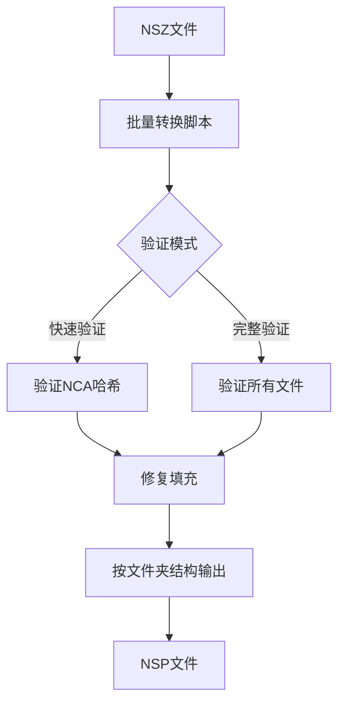

# 🎮 NSZ to NSP 批量转换工具

<div align="center">

**高效、可靠的Nintendo Switch NSZ文件批量转换工具**

[](https://www.python.org/)
[](https://github.com)
[](LICENSE)

[功能特性](#-功能特性) • [快速开始](#-快速开始) • [详细使用](#-详细使用) • [故障排除](#-故障排除)

</div>

---

## 📋 项目简介

基于 [nicoboss/nsz](https://github.com/nicoboss/nsz) 开发的增强版本，专为批量转换Nintendo Switch的NSZ压缩文件而设计。提供了完整的批量处理工具链，支持文件验证、目录结构保持等高级功能。

## ✨ 功能特性

| 功能 | 描述 | 状态 |
|------|------|------|
| 🔄 **批量转换** | 一次性转换多个NSZ文件 | ✅ |
| 📁 **目录保持** | 按原始文件夹结构组织输出文件 | ✅ |
| 🔍 **文件验证** | 快速验证和完整验证模式 | ✅ |
| 🔧 **兼容性优化** | PFS0填充修复，提高模拟器兼容性 | ✅ |
| 🖥️ **跨平台支持** | Windows、macOS、Linux全平台支持 | ✅ |
| ⚡ **多种脚本** | Python、Shell、批处理多种执行方式 | ✅ |
| 📊 **详细反馈** | 实时进度显示和转换统计 | ✅ |
| 🛠️ **诊断工具** | 内置问题诊断和修复工具 | ✅ |

## 🚀 快速开始

### 系统要求
- Python 3.6 或更高版本
- 足够的磁盘空间（NSP文件通常比NSZ大）

### 安装依赖

```bash
# 1. 创建虚拟环境
python3 -m venv venv

# 2. 激活虚拟环境
source venv/bin/activate    # macOS/Linux
# 或
venv\Scripts\activate       # Windows

# 3. 安装依赖包
pip3 install -r requirements.txt
```

### 基础使用

```bash
# 1. 将包含NSZ的文件或者文件夹，放入 input/ 文件夹

# 2. 执行批量转换（推荐）
python3 batch_convert.py --auto --quick-verify --fix-padding

# 3. 在 output/ 文件夹查看转换结果
```

## 📖 详细使用

### 转换模式选择

| 命令 | 说明 | 速度 | 推荐度 |
|------|------|------|--------|
| `--quick-verify` | 快速验证NCA哈希 | ⚡ 快 | ⭐⭐⭐⭐⭐ |
| `--verify` | 完整文件验证 | 🐌 慢 | ⭐⭐⭐⭐ |
| `--fix-padding` | 修复填充（提高兼容性） | ⚡ 快 | ⭐⭐⭐⭐⭐ |

### 使用示例

```bash
# 基础转换
python3 batch_convert.py --auto

# 推荐模式（兼容性最佳）
python3 batch_convert.py --auto --quick-verify --fix-padding

# 最安全模式（用于重要文件）
python3 batch_convert.py --auto --verify --fix-padding

# 查看所有选项
python3 batch_convert.py --help
```

### 跨平台脚本

```bash
# Windows
batch_convert.cmd

# macOS/Linux
./batch_convert.sh

# Python（跨平台）
python3 batch_convert.py
```

## 📁 目录结构

```
nsz-to-nsp/
├── input/              # 放置NSZ文件的目录
├── output/             # 转换后NSP文件的输出目录
├── batch_convert.py    # Python批量转换脚本
├── batch_convert.sh    # Shell脚本（macOS/Linux）
├── batch_convert.cmd   # 批处理脚本（Windows）
└── FAQ常见问题.md      # 详细问题解答和故障排除
```

## 🛠️ Keys配置

NSZ转换需要Switch密钥文件支持：

1. **NSZ转换工具密钥**：已包含在 `nsz/prod.keys`
2. **Ryujinx运行密钥**：需要从Switch实体机导出并配置

详细配置方法请参考：`FAQ常见问题.md`

## 🚨 故障排除

### 常见问题

| 问题 | 原因 | 解决方案 |
|------|------|----------|
| 模块导入错误 | 依赖未安装 | `pip install -r requirements.txt` |
| 找不到NSZ文件 | 文件位置错误 | 检查 `input/` 目录 |
| Ryujinx闪退 | Keys配置问题 | 参考使用指南配置密钥 |
| 转换失败 | 文件损坏 | 使用 `--verify` 选项 |

### 转换后验证

可以通过以下方式验证转换质量：
- 检查输出文件大小是否合理（NSP通常比NSZ大2-3倍）
- 使用 `--verify` 或 `--quick-verify` 选项进行转换时验证
- 在Ryujinx中测试游戏是否能正常运行

## 🎯 转换流程



## 📚 相关文档

- 🤔 [FAQ常见问题.md](FAQ常见问题.md) - 详细的问题解答和故障排除
- 📋 [目录结构](#-目录结构) - 项目文件组织说明

## 🤝 贡献

欢迎提交Issue和Pull Request！

## 📄 许可证

基于原项目许可证，详见 [LICENSE](LICENSE) 文件。

## 🙏 致谢

- 感谢 [nicoboss/nsz](https://github.com/nicoboss/nsz) 提供的优秀基础工具
- 感谢所有为Nintendo Switch模拟器生态做出贡献的开发者

---

<div align="center">

**⭐ 如果这个项目对你有帮助，请给个Star！**

</div>
